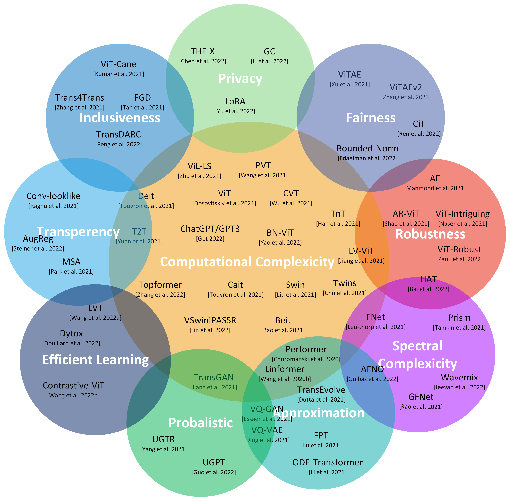
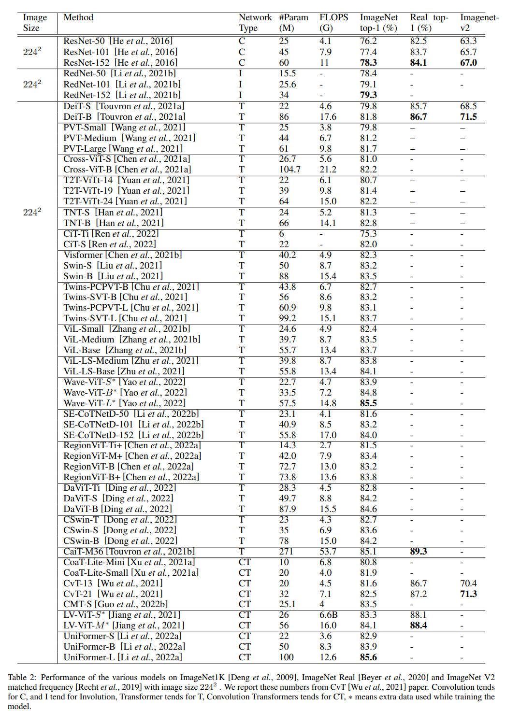

# Efficient360: Efficient Vision Transformer
Efficient 360 framework is collection of transformer models in various dimensions.

### Various Dimension of Efficient360
 

### Inference on Deit based transformer Model and its Grad-CAM Explanation
 

### Architecture performance of Various Transformer Models
 

### State of the Art resutls of various vision transformer models on ImageNet-1K dataset with Image size 224 x 224.
 

### State of the Art resutls of various vision transformer models on ImageNet-1K dataset with different Image sizes.
 
